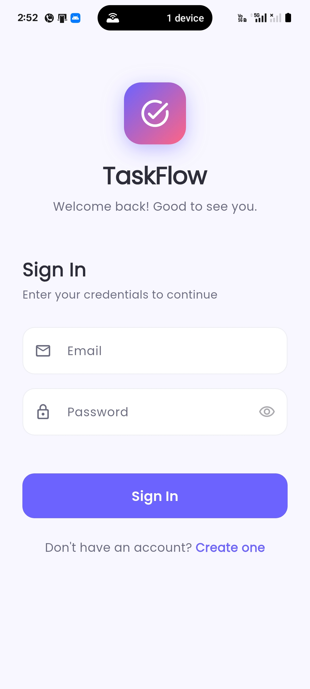
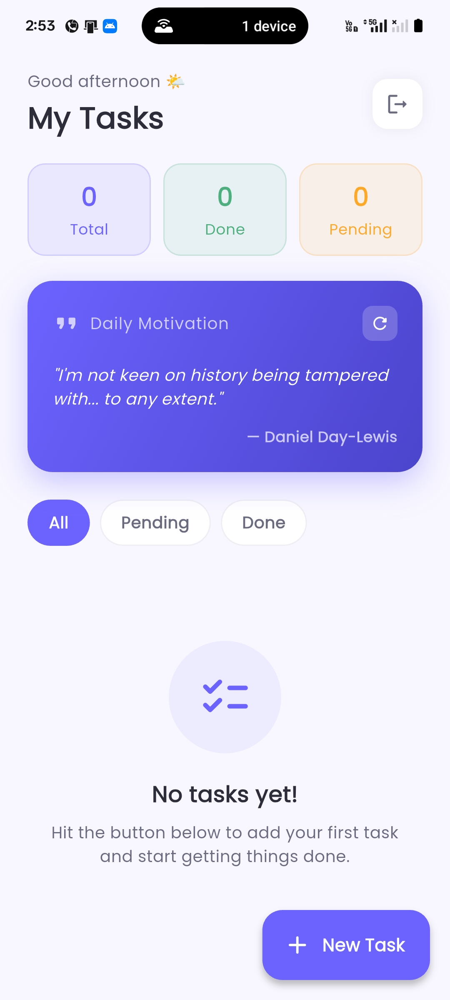
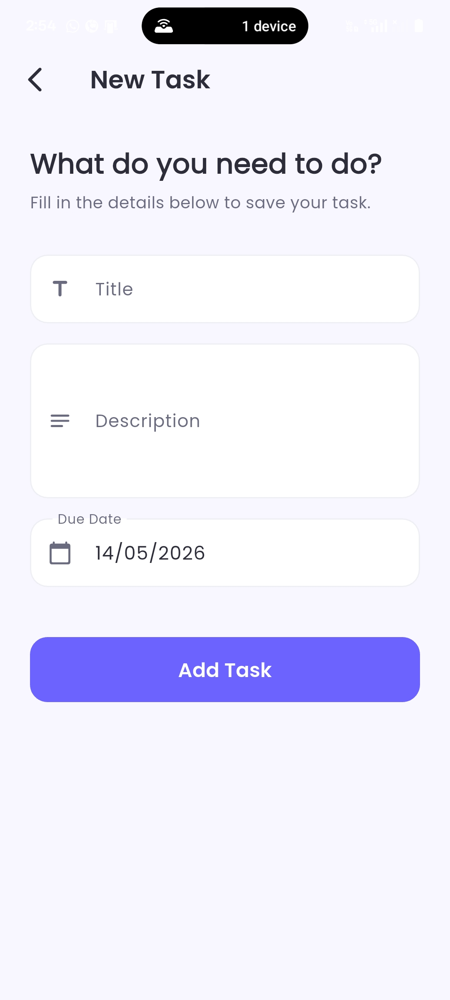
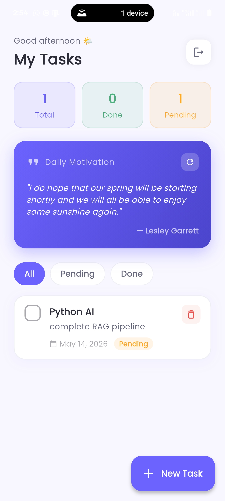
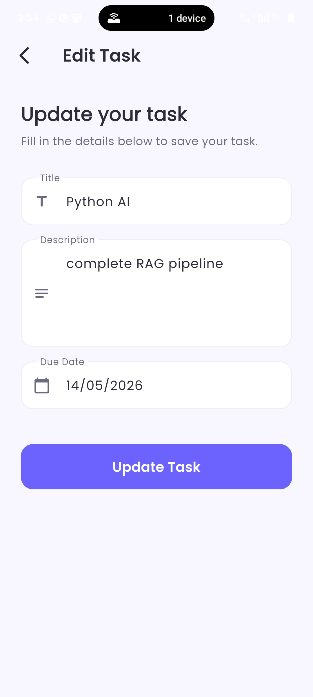
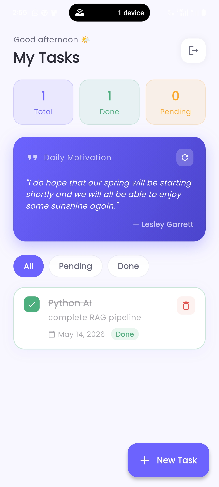

# TaskFlow — Flutter Task Manager App

A clean, full-featured Task Manager mobile application built with Flutter and Firebase as part of the **Sankar Group Flutter Development Internship Assignment**.

---

## 📱 Screenshots

<p align="center">

  
  
  
</p>

<p align="center">
  
  
  
</p>

---

## 🎥 Demo Video

[Watch TaskFlow Demo Video](https://drive.google.com/drive/folders/1bmklPuZ6SM6MbhdFUTwI8yR_hqyxqt_U?usp=sharing)

---

## ✨ Features

### 🔐 User Authentication (Firebase Auth)
- User Sign Up with email & password
- User Login
- Logout functionality
- Auth state persistence — stays logged in across app restarts
- Human-readable error messages for all Firebase Auth errors

### ✅ Task Management (Cloud Firestore)
- Add new tasks with title, description, and due date
- Edit existing tasks
- Delete tasks with confirmation dialog
- Mark tasks as Done / Pending with animated toggle
- Real-time sync — changes reflect instantly across devices
- Tasks are private per user (Firestore security rules enforced)

### 💬 Motivational Quotes (REST API)
- Fetches a random motivational quote on every app open
- Tap the refresh button to load a new quote
- **API used:** [API Ninjas Quotes API](https://api.api-ninjas.com/v1/quotes)
  > ⚠️ Note: The originally specified API (`https://api.quotable.io/random`) was **permanently shut down** and is no longer functional. We switched to the API Ninjas Quotes API which provides the same quote + author data reliably.

### 🎨 UI/UX
- Clean, modern design with consistent color system
- Greeting based on time of day (morning / afternoon / evening)
- Task stats dashboard (Total / Done / Pending)
- Filter tasks by All / Pending / Done
- Empty state illustration when no tasks exist
- Loading indicators on all async operations
- Form validation with inline error messages
- Error banners for auth failures

---

## 🗂️ Project Structure

```
lib/
├── models/
│   ├── task_model.dart        # Task data model + Firestore serialization
│   └── quote_model.dart       # Quote data model from API
├── screens/
│   ├── login_screen.dart      # Email/password login
│   ├── signup_screen.dart     # New user registration
│   ├── home_screen.dart       # Dashboard with task list and quote
│   └── task_form_screen.dart  # Add / Edit task form
├── services/
│   ├── auth_service.dart      # Firebase Authentication logic
│   ├── firestore_service.dart # Firestore CRUD operations
│   └── quote_service.dart     # REST API call for quotes
├── widgets/
│   ├── app_theme.dart         # Colors, ThemeData, AppColors constants
│   ├── custom_text_field.dart # Reusable styled text field
│   ├── task_card.dart         # Task list item card
│   ├── quote_card.dart        # Motivational quote display card
│   └── loading_button.dart    # Button with loading spinner
├── firebase_options.dart      # Auto-generated by FlutterFire CLI
└── main.dart                  # App entry point + AuthWrapper
```

---

## 🛠️ Tech Stack

| Technology | Usage |
|---|---|
| Flutter & Dart | UI framework |
| Firebase Authentication | User sign up / login / logout |
| Cloud Firestore | Real-time task storage |
| API Ninjas Quotes API | Motivational quote fetch |
| Google Fonts (Poppins) | Typography |
| `http` package | REST API calls |
| `intl` package | Date formatting |

---

## 🚀 Setup & Installation

### Prerequisites
- Flutter SDK `^3.9.0`
- Dart SDK `^3.9.2`
- Android Studio or VS Code
- A Firebase account

### Step 1 — Clone the repository

```bash
git clone https://github.com/YOUR_USERNAME/task_manager.git
cd task_manager
```

### Step 2 — Install dependencies

```bash
flutter pub get
```

### Step 3 — Firebase Setup

1. Go to [Firebase Console](https://console.firebase.google.com) and create a new project
2. Enable **Authentication → Email/Password**
3. Enable **Cloud Firestore** (start in test mode)
4. Install FlutterFire CLI and configure:

```bash
dart pub global activate flutterfire_cli
flutterfire configure
```

Select your Firebase project — this auto-generates `lib/firebase_options.dart`.

### Step 4 — Firestore Index

The task query requires a composite index. When you first run the app, you'll see a URL in the debug console:

```
The query requires an index. You can create it here: https://console.firebase.google.com/...
```

Open that URL and click **Create Index**. Wait 2–3 minutes for it to build.

**Alternatively**, the `firestore_service.dart` sorts tasks in Dart (client-side) to avoid needing the index entirely.

### Step 5 — API Ninjas Key

The quote service uses [API Ninjas](https://api-ninjas.com). The API key is already included in `quote_service.dart` for demo purposes. To use your own:

1. Sign up at [api-ninjas.com](https://api-ninjas.com)
2. Copy your API key
3. Replace the `_apiKey` value in `lib/services/quote_service.dart`

### Step 6 — Run the app

```bash
flutter run
```

### Build APK

```bash
flutter build apk --release
```

APK will be at: `build/app/outputs/flutter-apk/app-release.apk`

---

## 🔒 Firestore Security Rules

```
rules_version = '2';
service cloud.firestore {
  match /databases/{database}/documents {
    match /tasks/{taskId} {
      allow read, write: if request.auth != null
        && request.auth.uid == resource.data.userId;
      allow create: if request.auth != null
        && request.auth.uid == request.resource.data.userId;
    }
  }
}
```

---

## 📦 Dependencies

```yaml
dependencies:
  firebase_core: ^3.6.0
  firebase_auth: ^5.3.1
  cloud_firestore: ^5.4.4
  http: ^1.2.2
  google_fonts: ^6.2.1
  intl: ^0.19.0
```

---

## ⚠️ Known Notes

- `api.quotable.io` (originally specified in the assignment) is **permanently shut down** as of 2024. The app uses `https://api.api-ninjas.com/v1/quotes` as a fully working replacement that returns the same `quote` and `author` fields.
- The `GoogleApiManager` warnings in logcat (`Unknown calling package name 'com.google.android.gms'`) are a known Android emulator/device GMS issue and do not affect app functionality.

---

## 👨‍💻 Author

Built for the **Sankar Group Flutter Development Internship Assignment**

---

## 📄 License

This project is for internship evaluation purposes only.
